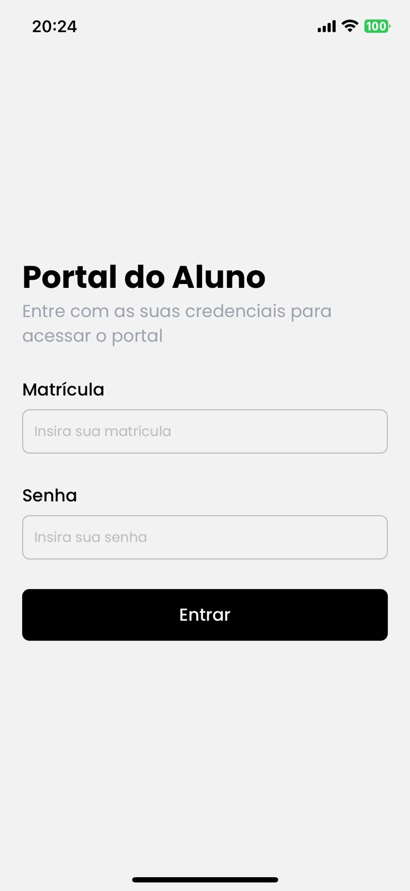
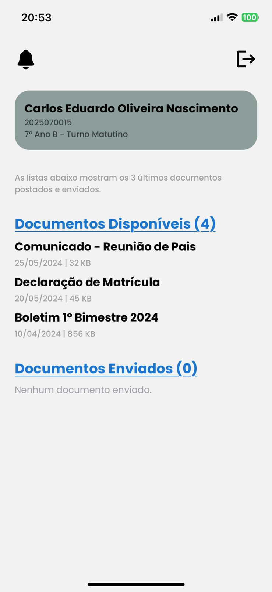
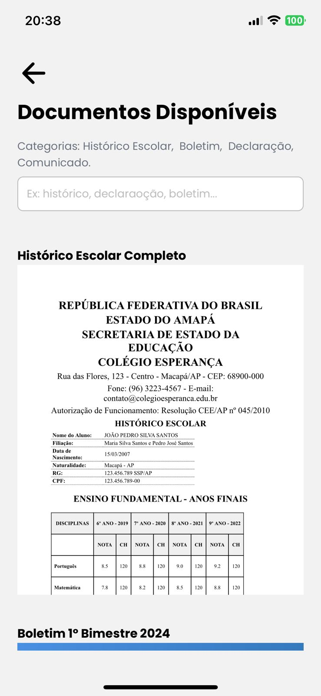
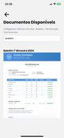
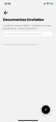
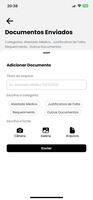
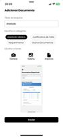
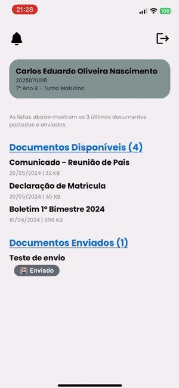

# Desafio Técnico Proesc: Portal de Documentos do Aluno

## **Descrição do Projeto**

Portal escolar que permite alunos e responsáveis realizarem login, visualizarem documentos escolares e enviarem novos documentos para a instituição de ensino.

## **Pré-requisitos**

Antes de prosseguir, certifique-se de ter instalado:

- Node.js (versão 20.19.4 ou superior)
- npm ou yarn
- Expo Go no dispositivo móvel (Androido | iOS)
  - Alternativa: Emulador Android Studio ou Xcode

## **Instalação e Configuração**

### 1. Clone o Repositório

```bash
# Via CMD ou bash
git clone https://github.com/antoniornneto/desafio-proesc-mobile.git

cd desafio-proesc-mobile

# Ou faça o download do .ZIP e exraia
```

### 2. Configuração do backend

Abra um terminal na raíz do projeto:

```bash
# bash
cd backend
npm install
```

Inicie o servidor:

```bash
# bash
npm run dev
```

Com o servidor ativo, você deve ver uma mensagem indicando que o servidor está rodando na porta 3000.

> Se a porta 3000 estiver em ocupada:
>
> 1.  Acesse `backend/src/server.ts`
> 2.  Altere o valor da variável `PORT`
> 3.  Reinicie o servidor

### 3. Configuração do frontend

Mantenha o terminal do backend aberto e abra outra janela de terminal também na raíz do projeto para o frontend:

```bash
# bash
cd frontend
npm install
```

Acesse a pasta `frontend/src/utils/config.ts` e altere as variáveis:

```
const IPLOCAL = '192.168.X.XX'; // Insira o IP da sua máquina
const PORT = '3000'; // Insira a mesma porta da variável PORT em backend/src/server.ts
```

> Caso não saiba qual é o IP da sua máquina:
>
> 1.  Abra uma janela do CMD;
> 2.  Digite `ipconfig` e pressione enter;
> 3.  Copie e cole o IP do final da linha `Endereço IPv4`
> 4.  Cole na variável `const IPLOCAL`

Salve o arquivo `config.ts` e inicie a aplicação:

```bash
# bash
npx expo start
```

#### Rodando no celular

Após executar `npx expo start`, escolha uma das opções:

- Para dispositivo físico:

  - iOS: Aponte a câmera do celular para o QR code
  - Android: Abra o Expo Go e escaneie o QR code

- Para emuladores:

  - Pressione `a` no terminal -> Android Emulador
  - Pressione `i` no terminal -> iOS Emulador

Estrutura do projeto:

```
desafio-proesc-mobile/
├── backend/        # Servidor Node.js
│ ├── src/
│ └── package.json
├── frontend/       # Aplicativo React Native + Expo 54
│ ├── src/
│ ├── components/
│ ├── context/
│ ├── hooks/
│ ├── routes/
│ ├── screens/
│ ├── styles/
│ ├── utils/
│ └── package.json
└── image/          # Recursos de imagem

```

✅ Pronto! Essas configurações devem ser suficientes para rodar o app e testar.

## **Testes e Funcionalidades**

### 1. Tela de login



```
# Credenciais de teste:

- matrícula: 2025070015
- senha: 123321
```

- Na tela de login, insira as credenciais e clique em `Entrar`.

### 2. Home



- Você será redirecionado para a `Home`, onde poderá ver os documentos diponíveis pela instituição por ordem de postagem e também verá a sua lista de documentos enviado. Essa lista começa vazia para que você faça os testes de envio de documentos.

- Você pode navegar para as telas `Documentos Disponíves` e `Documentos Enviados` para ver mais.

### 3. Documentos Disponíveis



- Nesta tela, você encontra na parte superior um `input` que te permite buscar os documentos pelas categorias sugeridas acima dele.



- Você pode navegar livremente tendo uma visualização prévia dos documentos `inline`. Note que, especificamente no `Android`, arquivos como `.docx` e `.pdf` não são exibidos porque na versão atual do `Expo (v.54)`, a lib que permitia a visualização foi descontinuada. Entretanto, no `iOS` é completamente possível visualizar os formatos `.docx`. `.pdf`, `.jpeg` `.html`.

### 4. Documentos Enviados



- Nesta tela, você encontra o mesmo `input` da tela anterior, porém com categorias diferentes.

- A tela também possui um botão de adicionar no canto inferior direito permitindo o usuário enviar um novo documento:



1. Clique no botão para abrir o modal `bottomsheet`;
2. Preencha o campo `título do arquivo`;
3. Escolha uma `categoria` clicando sobre ela até que ela fique com uma cor preta;
4. Escolha a fonte que virá o seu arquivo: `camera`, `galeria` e `arquivos`;
5. Será exibida a prévia do documento selecionado se possível (disponível somente para `iOS` para algumas extensões);
6. Clique em `enviar`;



- Assim que enviar o documento, você verá um `hot reload` na página para recarregar o seu arquivo. Para visualizar a mudança de status, volte para a tela de `Home` assim que enivar a foto clicando no botão de retorno `<-`.

### 5. Atualização em Tempo Real

- Uma vez que o documento foi enviado, você pode acompanhar a mudança de `status` do seu documento na tela inicial. Assim que é enviado, é possível ver o status `Enviado`.
- Após um tempo, é possível visualizar a página atualizando automáticamente e alterando o status sendo alterado para `Em Análise`.
- E por fim, mais uma atualização automática o status muda para `Aprovado` se estiver tudo certo com o seu documento.



> Você pode controlar o tempo em que a atualização ocorre de forma automática dentro da função `autoUpdateStatusFile` que pode ser encontrado na linha 31 do arquivo `/frontend/src/screen/Home.tsx`.
> Altere os valores de `inicio` e `analise`. Use unidades em milissegundos. Ex.: 1 seg > 1000, 5 seg > 5000.

---

# Conclusão

Com o ambiente configurado e o servidor rodando, você pode testar todo o fluxo do aplicativo — desde o login até o envio e atualização de status dos documentos.
