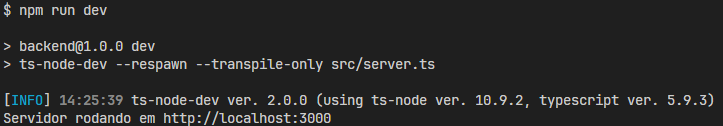

# Desafio Técnico Proesc: Portal de Documentos do Aluno

## **Descrição do Projeto**

Foi desenvolvido um aplicativo que simula um portal escolar, no qual o aluno ou responsável realiza o login, visualiza documentos escolares e pode enviar novos documentos para a instituição.

A seguir, estão descritos os passos necessários para executar o projeto em seu computador.

## **Configuração Inicial**

Faça o clone do repositório na sua área de trabalho (ou no diretório de sua preferência) realizando o download do arquivo .ZIP ou via terminal. Caso tenha feito o download, extraia os arquivos e acesse a pasta correspondente via terminal, seguindo o caminho de onde os arquivos foram extraídos.

**Requisitos importantes:**

- Para testar o aplicativo, é altamente recomendável ter o aplicativo `Expo Go` instalado em seu dispositivo móvel. Como alternativa, é possível utilizar um emulador em seu computador.
- Para cada pasta do projeto, utilize uma janela independente do CMD. Dessa forma, uma será destinada à execução do servidor e outra à execução da aplicação, mantendo ambas abertas simultaneamente.

### **1. Executando o Servidor (Backend)**

1.1. Em uma das janelas do CMD, localize a raiz do projeto, acesse a pasta `backend` e execute os comandos abaixo para instalar as dependências e iniciar o servidor:

```
cd backend

npm install
```

1.2. Após a conclusão da instalação, execute o comando:

```
npm run dev
```

1.3. No terminal, deverá ser exibida uma mensagem semelhante à imagem a seguir:



> _Observação: Caso já exista algum projeto em execução na porta 3000, acesse o arquivo `server.ts` em `desafio-proesc-mobile/backend/src/server.ts` e altere a variável `PORT` para uma porta livre._

### **2. Iniciando a Aplicação (Frontend)**

Com o servidor em execução em uma das janelas do CMD, prossiga para a instalação e inicialização da aplicação em outra janela.

2.1. Utilize uma nova janela do CMD, também posicionada na raiz do projeto, acesse a pasta `frontend` e instale as dependências com o comando:

```
cd frontend

npm install
```

2.2. Após a instalação, execute o projeto com o comando:

```
npx expo start
```

2.3. Com a aplicação em execução, é possível:

- Apontar a câmera do dispositivo móvel para o QR Code exibido no terminal (iOS);
- Escanear o QR Code utilizando o aplicativo Expo Go (Android);
- Pressionar a tecla `a` no terminal para executar no emulador Android (certifique-se de que o emulador esteja ativo);
- Pressionar a tecla `i` no terminal para executar no emulador iOS (certifique-se de que o emulador esteja ativo);
- Caso a tela abaixo seja exibida, a configuração foi concluída com sucesso:
  

### **Credenciais de Teste**

- Matrícula: 2025070015
- Senha: 123321
